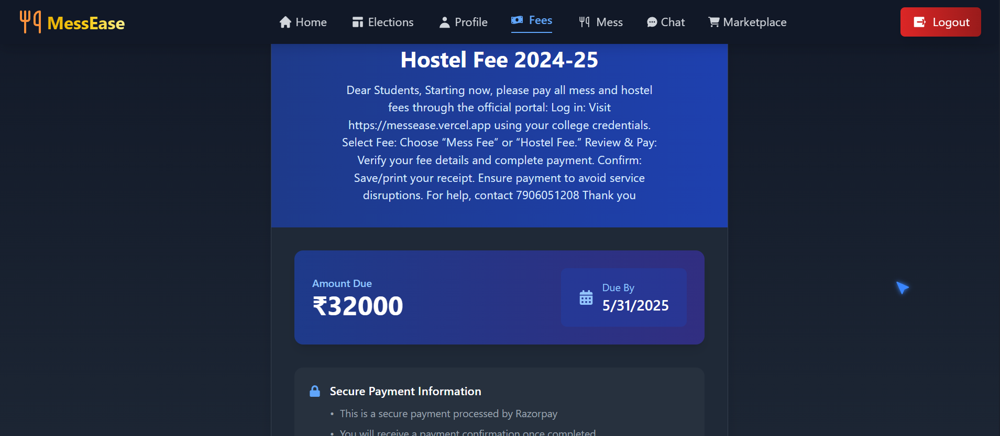

# MessEase
<!-- 
MessEase is a streamlined, user-friendly solution designed to simplify the management of mess operations. Whether you're running a cafeteria, a dormitory, or an event venue, MessEase helps you keep everything organized, efficient, and stress-free. -->
MessEase is a comprehensive platform designed to streamline mess and hostel management for educational institutions. Our solution simplifies administrative tasks, enhances communication between students and staff, and provides tools for efficient resource management.

## Features

### 1.Core Management

- **Intuitive Interface:** Easy-to-use dashboard for managing tasks and schedules.
- **Automated Scheduling:** Seamlessly schedule shifts and mess operations.
- **Real-Time Monitoring:** Keep an eye on operations as they happen.
- **Detailed Reporting:** Generate insightful reports to track performance.
- **Customizable Settings:** Adapt the system to meet your specific mess management needs.
- **Secure & Scalable:** Built with security and future growth in mind.
;

### 2.Complaint Management
-**Features include:**
- Submit and track complaints related to mess and hostel facilities
- Admin dashboard for reviewing and resolving complaints
- Status updates for submitted complaints
- Analytics to identify recurring issues


### 3.Marketplace for students
- A platform for students to buy, sell, or exchange study materials and academic resources.
- **Features include:**
  - Post listings for books, gadgets, or study aids.
  - Search and filter listings by category, price, or condition.
  - Chat directly with sellers.
  - Secure payment integration.
  - Wishlist page to save items for future consideration.
  - My Listings page to manage your posted items.
- **Marketplace:**  


### 4.Election for manager post
- A plateform where warden of the hostel can raise a election form where interested one can apply for given post
- **Features**
- Digital election system for mess and hostel manager positions
- Candidate registration and profile creation
- Secure voting mechanism
- Real-time results and analytics


### 5.Fees Management 
- Admin interface for raising hostel fee requests
- Student notification system for pending payments
- Secure payment gateway integration
- Payment history and receipt generation




### 6.Guest Room Allocation
- Online booking system for guest rooms
- Availability calendar with real-time updates
- Approval workflow for guest stay requests
- Check-in/check-out management
- Payment processing for room charges
- Guest history and reporting


## Installation

1. **Clone the repository:**

    ```bash
    git clone https://github.com/Hersheys-commits/MessEase.git
    cd MessEase
    ```

2. **Install dependencies:**

    ```bash
    npm install
    ```
    or
    ```bash
    yarn install
    ```

3. **Run the project locally**
    ```bash
   npm run dev

   ```

---

## Frontend

### Steps 

1. **Install dependencies:**

   ```bash
   npm install
   ```

2. **Run the development server:**

   ```bash
   npm run dev

   
3. **Add a `.env` file** and provide the following environment variables:

    ```
    VITE_GOOGLE_CLIENT_ID   
    VITE_SERVER_URL
    ```

## Backend

### Steps

1. **Add a `.env` file** and provide the following environment variables:

   ```env
    PORT=4001
    MONGODB_URI
    CLOUDINARY_CLOUD_NAME
    CLOUDINARY_API_KEY
    CLOUDINARY_API_SECRET

    ACCESS_TOKEN_SECRET
    ACCESS_TOKEN_EXPIRY
    REFRESH_TOKEN_SECRET
    REFRESH_TOKEN_EXPIRY

    GOOGLE_CLIENT_ID
    NODE_ENV

    EMAIL_USER
    EMAIL_PASS

    SENDINBLUE_API_KEY

    RAZORPAY_API_KEY
    RAZORPAY_API_SECRET

    CLIENT_URL
   ```
2. **Install dependencies:**

   ```bash
   npm install
   ```

3. **Run the project locally:**

   ```bash
   npm dev start
   ```

---


3. **Create a `.env` file:**  
   Create a `.env` file in the root directory and configure the required environment variables:

    ```env
    PORT=3000
    DATABASE_URL=your-database-url

    ```

4. **Run the development server:**

    ```bash
    npm start
    ```
    or
    ```bash
    yarn start
    ```

5. **Open in your browser:**  
   Navigate to [http://localhost:5173](http://localhost:5173) to access the MessEase dashboard.

## Usage

After installation, MessEase provides an interactive dashboard where you can:
- Schedule and manage mess operations.
- Monitor tasks in real time.
- Generate and view detailed performance reports.
- Configure settings to match your facility's requirements.


## License

MessEase is licensed under the MIT License. See the [LICENSE](LICENSE) file for details.

## Contact

For questions or suggestions, please contact [harsh1618sharma@gmail.com](mailto:harsh1618sharma@gmail.com).

---

